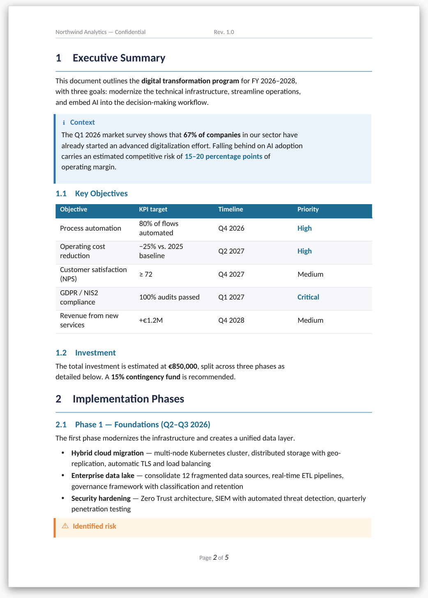
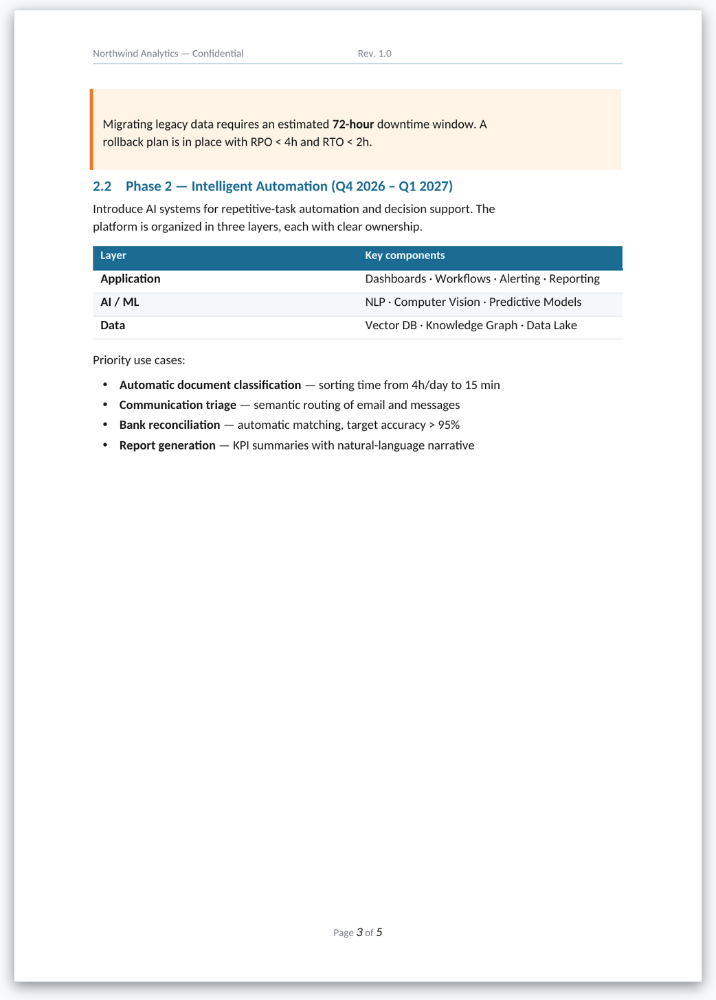
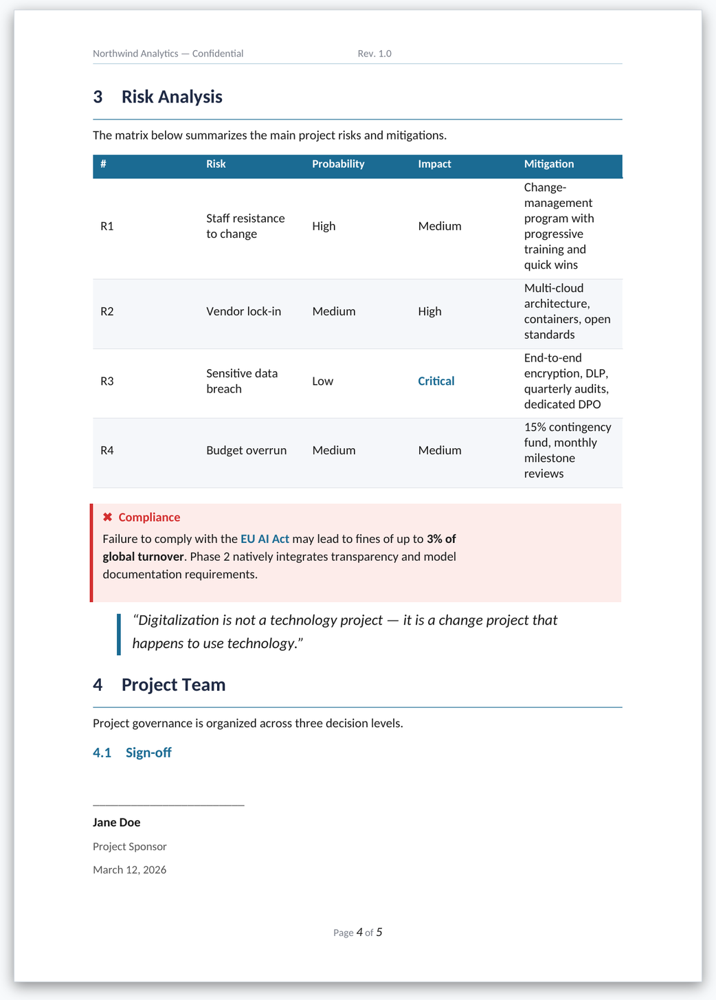

# Generate Documents — Native DOCX engine for Open WebUI

A [Open WebUI](https://github.com/open-webui/open-webui) **Tool** that generates
**native Word (.docx)** documents from Markdown (with YAML frontmatter) or a JSON
spec produced by the model. It doesn't export HTML or PDF: it builds the document
directly with `python-docx`, with a coherent design system — cover pages, numbered
headings with rules, styled tables, callouts, code blocks, signatures, TOC and a
running header/footer.

The resulting file is saved through Open WebUI's **Files API** (with a `/cache/files`
fallback) and a clickable **download link** appears in the chat.

> License: MIT · Author: [IANUSTEC](https://ianustec.com)


*Document generated from the example [`examples/report.md`](examples/report.md) → [`examples/demo_report.docx`](examples/demo_report.docx).*

## Features

- **Native, editable .docx** (text, tables and styles are editable in Word / Pages / LibreOffice).
- **Dual input, auto-detected**: Markdown-with-frontmatter (preferred) **or** JSON — same output.
- **7 templates** with a coherent palette derived from a single `accent` color:
  `report`, `whitepaper`, `proposal`, `letter`, `memo`, `minutes`, `blank`.
- **Cover pages**: `band` (accent panel), `rule` (editorial) or `plain`.
- **Numbered headings** (1, 1.1, 1.1.1) with H1/H2 accent rules — auto-strips any manual number.
- **Rich tables**: filled accent header, zebra rows, automatic right-alignment of numeric/currency columns.
- **Callouts**: `info`, `success`, `warning`, `danger` (colored bar + tint).
- **Lists** (bullets, ordered, checklists), **blockquotes**, **code blocks**, **signatures**, **TOC**, page breaks.
- **`==highlight==`** maps to accent-colored emphasis; smart quotes; typographic spacing.
- **Header / footer** with 3 zones (`left`/`center`/`right`) and live page numbers (`{{page}}` / `{{pages}}`).
- **Human-readable filename** derived from the title (e.g. `Q3 Board Report.docx`).
- **Optional images** from Unsplash (with a key) or generated via Open WebUI.
- **Single-file**: one self-contained `.py`, ready to paste into the Tools registry.

## Requirements

- Open WebUI `>= 0.4.0`
- Python: `python-docx`, `Pillow`, `markdown-it-py`, `mdit-py-plugins`, `PyYAML`, `lxml`
  (declared in the frontmatter → Open WebUI installs them automatically)
- Optional: `httpx` (fetch images from URL / Unsplash)

## Installation

### Option A — from the Open WebUI community
1. Open the tool page on the Open WebUI community site.
2. Click **Get** / **Import** to your instance.

### Option B — manual
1. In your Open WebUI instance go to **Workspace → Tools → +**.
2. Paste the contents of [`generate_documents.py`](generate_documents.py).
3. Save. The declared dependencies are installed on first use.
4. Enable the tool for the model (or chat) that should use it.

## Usage

The model calls `generate_document(content)`, where `content` is **either**
Markdown-with-frontmatter (preferred) **or** a JSON string.

### Markdown (preferred)

```markdown
---
template: report
title: "Digital Transformation Program — FY 2026"
subtitle: "Strategic plan, roadmap and budget"
author: "Northwind Analytics"
cover: auto
header:
  left: "Northwind Analytics — Confidential"
  right: "Rev. 1.0"
footer:
  center: "Page {{page}} of {{pages}}"
styles:
  accent: "#1B6B93"
---

# Executive Summary

Revenue grew **24%** year over year.

::: callout type="success" title="Highlight"
Operating margin expanded by ==6 pp==.
:::

| Objective | KPI target | Priority |
|-----------|-----------|----------|
| Process automation | 80% of flows | ==High== |
```

See the full example in [`examples/report.md`](examples/report.md).

### JSON (legacy, still supported)

```json
{
  "template": "report",
  "title": "FY 2026 Report",
  "cover": "auto",
  "styles": { "accent": "#1B6B93" },
  "blocks": [
    { "type": "heading", "level": 1, "text": "Executive Summary" },
    { "type": "paragraph", "text": "Revenue grew 24% YoY." },
    { "type": "callout", "kind": "success", "title": "Highlight", "text": "Margin +6pp." }
  ]
}
```

### Templates
`report` · `whitepaper` · `proposal` · `letter` · `memo` · `minutes` · `blank`.
Every template derives its full palette from a single `accent` color, so
`styles: { accent: "#C0392B" }` re-themes the whole document.

### Content blocks (Markdown syntax)

| Block | Syntax |
|---|---|
| Headings | `# H1` … `#### H4` (auto-numbered in `report`/`whitepaper`) |
| Emphasis | `**bold**`, `*italic*`, `` `code` ``, `==highlight==` |
| Lists | `- bullet`, `1. ordered`, `- [ ] checklist` |
| Table | standard Markdown pipe table (numeric columns auto right-aligned) |
| Callout | `::: callout type="info\|success\|warning\|danger" title="..."` … `:::` |
| Quote | `> quoted text` |
| Code | fenced ```` ``` ```` block |
| Signature | `::: signature name="..." role="..." date="..."` … `:::` |
| TOC | `[[toc]]` |
| Page break | `\newpage` |

## Screenshots

| Cover | Content |
|---|---|
|  |  |
| **Callouts & tables** | **Risk matrix & signatures** |
|  |  |

## Valves (configuration)

| Valve | Default | Description |
|---|---|---|
| `default_template` | `blank` | Template used when the spec doesn't set one |
| `unsplash_access_key` | `""` | Unsplash key for stock images (optional) |
| `image_generation_url` | `""` | OpenAI-compatible image endpoint (optional) |
| `image_generation_api_key` | `""` | Bearer token for `image_generation_url` |
| `docx_export_dir` | `/app/backend/data/cache/files` | Fallback directory for saving |
| `emit_status` | `true` | Emit status events in chat |

## How it works

1. The model produces Markdown (or JSON) and calls `generate_document`.
2. The parser normalizes both formats into one spec, merges it with the template
   defaults, and resolves the accent palette.
3. Each block is written as native OOXML (paragraphs, tables, shading, borders, fields).
4. The `.docx` is saved via the Files API (fallback `/cache/files`) and the link is returned in chat.

## Local development / testing

Requires `python-docx`, `markdown-it-py`, `mdit-py-plugins`, `PyYAML` (and optionally `pillow`/`httpx`):

```bash
pip install python-docx pillow httpx markdown-it-py mdit-py-plugins PyYAML
python examples/build.py   # → examples/demo_report.docx
```

The file is designed to run inside Open WebUI: the `open_webui.*` imports are optional
and the tool degrades gracefully when they're missing (handy for isolated render tests).

## Contributing

Issues and PRs welcome. Please keep the file **single-file** and free of mandatory
network dependencies for the core features.

## License

[MIT](LICENSE) © IANUSTEC
